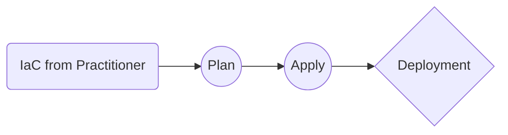

# Welcome to my basic Terraform Templates!

Hi! In this repo you will find a few basic Terraform deployment templates created by **Brandon Grant**. They are scripts and tooling that I have used in recent deployments, unfortunately they have been simplified greatly to allow them to become opensource. Should still be a solid starting point going forward though!

## What is Terraform

If you are unfamiliar, Terraform is a IaC (Infrastructure as Code) tool. It can be used to provision and manage instances of services, code or infrastructure. In a cloud service or even locally.
Here are the [docs](https://www.terraform.io/docs/index.html) if you wish to learn more about Terraform.

# Publication

These basic templates are free for use and if you require any assistance with adaptation please do not hesitate but add an issue.

> Please try Google the next steps atelast once before logging a ticket ;)

## Templates in this Repo

SmartyPants converts ASCII punctuation characters into "smart" typographic punctuation HTML entities. For example:

|Template                                      |Cloud Environment   |Resources                                                                               |
|----------------------------------------------|--------------------|----------------------------------------------------------------------------------------|
|terraform-azurerm-sql_server                  |Azure               |SQL Server, SQL Database, AD Admin                                                      |
|terraform-azurerm-kubernetes_elasticsearch    |Azure               |Resource Group, Kubernetes Storage Class, Elasticsearch (Client, Master and Data Nodes) |
|terraform-azurerm-sql_server                  |Azure               |SQL Server, SQL Database, AD Admin                                                      |

## How Terraform Basically Works

This is a basic flowchart of the process flow for Terraform IaC Deployments:

